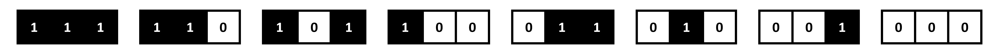
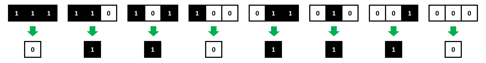
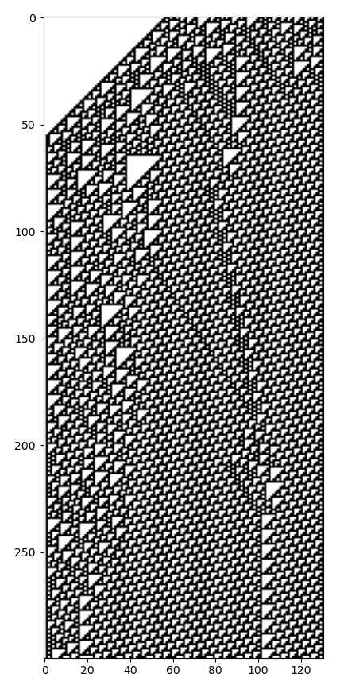

# TP 1 : De la programmation procédurale vers l'Orienté Objet

_Lors de ce TP, nous allons réviser la programmation procédurale en Python._
_Vous devrez programmer un automate cellulaire élémentaire, en complétant petit à petit les fonctions d'un programme._
_En fin de TP, nous réfléchirons à la manière dont ce programme pourrait être transformé en Orienté Objet._

---

## Les automates cellulaires élémentaires

On appelle **automate cellulaire élémentaire** un algorithme itératif qui va initialiser une matrice 1D infinie, dont les éléments ne peuvent prendre que les valeurs 0 ou 1 :

A chaque itération, chaque élément de la matrice change ou non de valeur, suivant une série de règles sur :

* La valeur de l'élément à sa gauche.

* La valeur de l'élément à sa droite.

* La valeur de l'élément lui-même.

Pour chaque élément, il n'y a donc que **8 configurations possibles** :

Il suffit donc de définir la valeur que prendra l'élément dans ces 8 situations pour obtenir les **règles** d'un automate cellulaire élémentaire.

On en déduit qu'il n'existe que **256 jeux de règles possibles**, soit autant d'automates cellulaires élémentaires différents.

En 1983, le mathématicien anglais Stephen Wolfram a proposé une manière d'identifier ces 256 automates, avec un numéro.

Si nous définissons la valeur que prend un élément d'un automate dans les 8 configurations possibles, dans cet ordre :

On obtient la série de nombres binaires 01101110, qui correspond en décimal à 110.

Ce numéro, que l'on nomme **code de Wolfram**, sera l'identifiant de cet automate. 
On parlera aussi de "règle n°110".

Voici l'évolution de l'automate cellulaire n°110 pour une itération :

Il est bien entendu impossible de simuler l'évoluation d'une matrice 1D infinie avec un ordinateur.
On définira donc une matrice 1D de dimensions finies, et on pourra choisir de gèrer les cas sur les bords de différentes façons :

* Ne jamais faire varier les cases sur les bords.

* Faire comme si une case imaginaire à gauche du bord gauche était à 0 et une case imaginaire à droite du bord droit était à 0.

* Faire comme si la case à gauche du bord gauche était la case du bord droit, et la case à droite du bord droit était la case du bord gauche.

_Vérifions si vous avez tout compris : quelles sont les règles de l'automate n°90 ?_
_Si nous initialisons l'automate avec 010110100, quelle serait l'état de l'automate à l'itération suivante (en ne faisant pas varier les bords) ?_

Lors de ce TP, nous allons programmer un automate cellulaire élémentaire de code de Wolfram donné, pour un nombres d'itérations donné un état initial donné.

Nous allons diviser ce problème complexe en fonctions simples : nous ferons donc ici de la **programmation procédurale**.

## Déterminer les règles de l'automate

Pour commencer, il nous faut des fonctions pour convertir le numéro d'un automate cellulaire en ses 8 règles.

Complétez la fonction `nb_to_bin` suivante :

~~~
def nb_to_bin(rule_number):

	#Complétez ici
    
    return wolfram_code
~~~

Elle prendra en entrée un entier `rule_number` correspondant au numéro de la règle de l'automate.
Elle retournera en sortie une chaîne de caractères `wolfram_code`, contenant la conversion en binaire de l'entier `rule_number`.
Cette chaîne de caractère contiendra toujours 8 caractères.

|Aide|
|:-|
|Pour convertir un nombre décimal en binaire, il suffit d'appliquer des divisions entières par 2 à ce nombre, jusqu'à ce que le quotient devienne nul. La juxtaposition des restes est la conversion en binaire du nombre.|
|En Python, l'opérateur de la division entière est `//`, celui du reste de la division entière est `%`.|

Complétez ensuite la fonction `bin_to_rule` suivante :

~~~
def bin_to_rule(wolfram_code):

	#Complétez ici
    
    return rule_dict
~~~

Elle prendra en entrée une chaîne de 8 caractères `wolfram_code`, telle que renvoyée par la fonction `nb_to_bin`.
Elle retournera en sortie un dictionnaire contenant les clés '111', '110', '101', '100', '011', '010', '001' et '000', correspondant aux configurations possibles pour chaque élément de l'automate.
Chaque clé contiendra '0' ou '1' suivant les règles de l'automate.

Nous nous servirons du dictionnaire de règles généré par la fonction `bin_to_rule` afin de déterminer les changements des valeurs d'un automate d'une itération à une autre.

## Initialiser l'automate

Nous allons à présent programmer une fonction pour définir l'état initial d'un automate cellulaire.

Complétez la fonction `init_automaton` suivante :

~~~
def init_automaton(init_sequence):
    
    #Complétez ici
    
    return auto_vect
~~~

Elle prendra en entrée une chaîne de caractères `init_sequence`, ne contenant que des '0' ou des '1'.
Elle retournera en sortie une matrice Numpy 1D contenant la même séquence de 0 et de 1, sous la forme d'entiers.

## Mettre à jour l'automate

Nous pouvons à présent déterminer les règles d'un automate, et l'initialiser.
Il nous faut maintenant une fonction pour le mettre à jour à chaque itération, en se basant sur les règles déterminées.

Complétez la fonction `update_automaton` suivante :

~~~
def update_automaton(auto_vect,rule_dict):
    
    #Complétez ici
    
    return auto_vect
~~~

Elle prendra en entrée une matrice Numpy 1D `auto_vect` contenant l'état de l'automate à une itération donnée, et `rule_dict` un dictionnaire tel que renvoyé par la fonction `bin_to_rule`.
Elle retournera en sortie une matrice Numpy 1D `auto_vect`, contenant l'état de l'automate à l'itération suivante, déterminé à partir des règles de l'automate.

|Aide|
|:-|
|Pour réaliser une copie indépendante d'une matrice Numpy, il faut utiliser la méthode `copy` de Numpy.|
|Pour convertir une valeur en entier ou en chaîne de caractère, on peut utiliser les méthodes natives de Python `int` et `str`.|

## Itération de l'automate

Ça y est, nous avons à présent toutes les fonctions dont nous avons besoin pour faire tourner un automate cellulaire élémentaire.

Nous allons définir une fonction appellant les fonction programmées précédemment, pour itérer un automate cellulaire donné, un nombre de fois donné, pour une initialisation donnée.

Complétez la fonction `iterate_automaton` suivante :

~~~
def iterate_automaton(init_sequence,rule_number,nb_iterations):
    
    #Complétez ici
        
    return auto_mat
~~~

Elle prendra en entrée une chaîne de caractères `init_sequence` contenant la séquence de '0' et de '1' pour initialiser l'automate, un entier `rule_number` correspondant au numéro de règles (code de Wolfram) de l'automate, et un entier `nb_iterations` correspondant au nombre d'itérations pour lequel faire tourner l'automate.
Elle retournera en sortie une matrice Numpy 2D concaténant verticalement les états de l'automate au fil des itérations.

## Affichage de la simulation

~~~
def display_automaton(auto_mat):
    
    plt.imshow(auto_mat,cmap='binary')
    
rule = 110

init_sequence = '00000000000000000000000000000000000000000000000000000000111011010010001100000100111010110001011000001110111001100100100011001011001'

#Complétez ici
~~~

## Vers l'Orienté Objet

