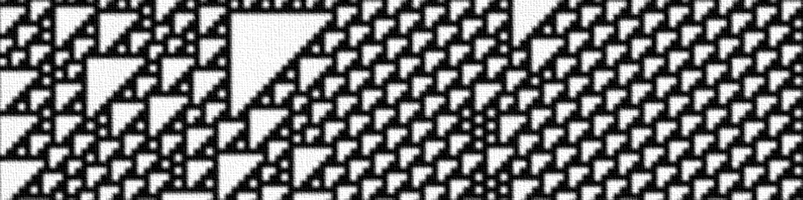
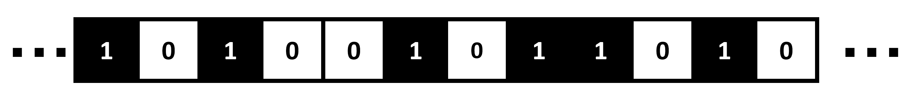
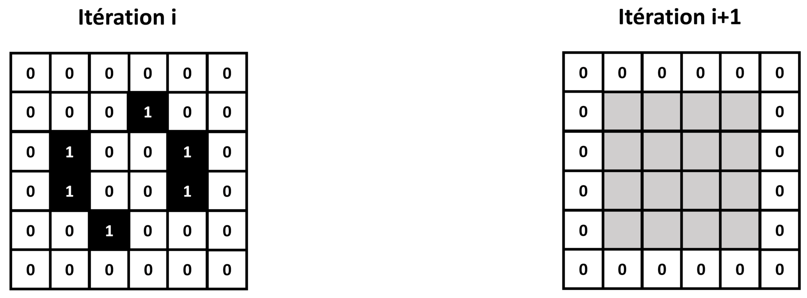
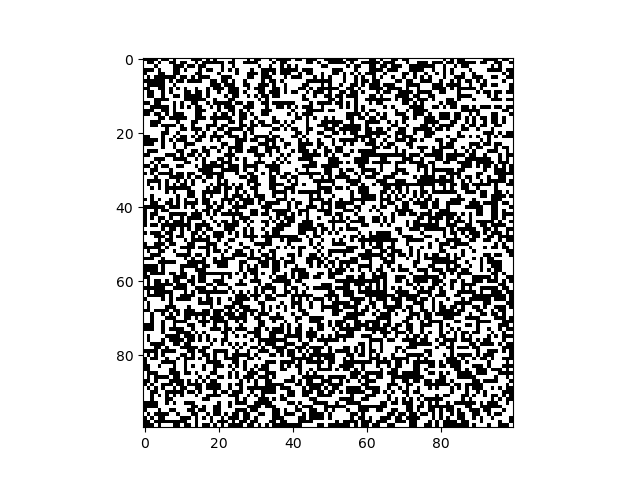

# TP 1 : Les classes, leurs attributs et leurs méthodes

_Lors de ce TP, nous allons programmer un automate cellulaire 2D de type "life-like", en complétant petit à petit les attributs et méthodes d'une classe._
_En fin de TP, nous réfléchirons à comment nous pourrions améliorer notre programme pour rendre certaines parties réutilisables par d'autres types d'automates cellulaires._

---

## Le Jeu de la Vie

Lors du TP précédent, nous avons vu des automates cellulaires 1D : chaque valeur d'une matrice 1D ne contenant que des 0 et des 1 évolue au fil des itérations, suivant des règles sur son voisinage.
Ce concept peut être étendu à une matrice 2D, et nous obtenons alors un **automate cellulaire 2D** :

Dans le cas d'un automate 1D, on définit le "voisinage" d'une case comme étant les cases directement à sa droite ou à sa gauche.
Pour un automate 2D, il nous faut une nouvelle définition de "voisinage".
La plus commune est le **voisinage de Moore** : les 8 cases entourant une case donnée.

Les règles d'un automate cellulaire 2D se basent en général sur 2 choses :

* La valeur de la case, 0 ou 1.

* Le nombre de ses 8 voisins égaux à 0 ou 1.

Les cas sur les bords pourront être gérés d'une manière similaire aux automates 1D.

En 1970, le mathématicien anglais John Horton Conway a découvert que pour des règles aussi simples émergent parfois des comportements complexes, donnant l'impression de voir des organismes vivant évoluer sur la grille de l'automate.

Un jeu de règles en particulier est devenu célèbre : le **"Jeu de la Vie"**.
Pour chaque itération :

* Si une case est à 0, et est entourée de 3 voisins à 1, alors elle passe à 1. Sinon, elle reste à 0.

* Si une case est à 1, et est entourée de 2 ou 3 voisins à 1, alors elle reste à 1. Sinon, elle passe à 0.

Ces règles font apparaitre des motifs se déplaçant plus ou moins vite sur la grille, intéragissant les uns avec les autres, ce qui leur donne l'apparence d'organismes vivant.

On fait d'ailleurs souvent l'analogie avec le vivant, en disant d'une case à 0 qu'elle est "morte", et d'une case à 1 qu'elle est "vivante".

Le "Jeu de la Vie" est probablement le plus connu de tous les automates cellulaires 2D.
Mais c'est loin d'être le seul à faire émerger des comportements complexes.

On qualifiera de **"life-like"** tout automate cellulaire 2D donnant l'impression de voir des organismes vivant naître, évoluer et mourir.

Afin de définir les règles d'un automate cellulaire "life-like" de manière standardisée, on utilise souvent la notation **B/S**.

B et S sont des séries de numéros entre 0 et 8 correspondant respectivement aux nombres de voisins "vivants" (à 1) pour qu'une case "naisse" (passe de 0 à 1), et au nombre de voisins "vivants" (à 1) pour qu'une case puisse survivre (rester à 1).

On en déduit que le "Jeu de la Vie" peut être définit au format B/S par : **3/23**.

_Vérifions si vous avez bien compris. L'automate cellulaire "diamoeba" est définit par 35678/5678. Quelles sont donc ses règles ?_

Lors de ce TP, nous allons programmer un automate cellulaire de type "life-like", sous la forme d'une **classe** Python avec des attributs et des méthodes qu'il nous faudra définir.

**N'oubliez pas d'importer Numpy et Matplotlib au début de votre programme !**

## Définition de classe et constructeur

Pour définir un automate cellulaire "life-like" dans Python, nous allons créer une classe `life-like`, qui définira les attributs et méthodes nécessaires à tous les automates cellulaires.
Il suffira ensuite de créer une instance de cette classe pour pouvoir simuler un automate cellulaire "life-like" en particulier.

Voici la structure de la classe que nous allons programmer :

~~~
class life_like:
    
    def __init__(self,rules_code,grid_size_x,grid_size_y):
        
		#Complétez ici
        
    def set_rules(self,rules_code):
        
		#Complétez ici
        
    def get_rules(self):
        
		#Complétez ici
        
    def set_random_grid(self,grid_size_x,grid_size_y):
        
		#Complétez ici
        
    def set_grid(self,grid):
        
		#Complétez ici
    
    def get_grid(self):
        
		#Complétez ici
    
    def get_grid_size(self):
        
		#Complétez ici
                
    def get_neighbors(self):
        
		#Complétez ici
        
    def get_iteration(self):
        
		#Complétez ici
        
    def iterate_grid(self,nb_iterations):
	
        #Complétez ici
        
    def display_grid(self):
        plt.figure()
        plt.imshow(self.grid,cmap='binary')
        plt.show()
        
    def save_grid(self):
        plt.figure()
        plt.imshow(self.grid,cmap='binary')
        plt.savefig('automaton_'+str(self.iteration)+'.png')
        plt.close()
~~~

Vous devrez compléter petit à petit les méthodes de cette classe.

Pour commencer, complétez le constructeur :

~~~
    def __init__(self,rules_code,grid_size_x,grid_size_y):
        
		#Complétez ici
~~~

Pour rappel, le constructeur est la méthode appelée à la création d'une instance de la classe.
C'est là que sont initialisés les attributs d'instance.

Il prendra en entrée une chaîne de caractères `rules_code` contenant la définition de l'automate au format 'B/S', et 2 entiers `grid_size_x` et `grid_size_y` contenant les dimensions de la grille de l'automate.

Il initialisera 3 attributs d'instance de la manière suivante :

* `rules` en utilisant une méthode `set_rules`, qui prendra en entrée `rules_code`, et que nous programmerons plus tard.

* `grid` en utilisant une méthode `set_random_grid`, qui prendra en entrée `grid_size_x` et `grid_size_y`, et que nous programmerons plus tard.

* `iteration` directement initialisé à 0, et qui nous servira à suivre le nombre d'itération pour lequel a tourné l'automate depuis son initialisation.

_Quelle ligne de commande Python utiliseriez-vous pour créer un automate cellulaire "Jeu de la Vie" de Conway, avec une grille 100x100 ?_ 

## Définir les getters

Lorsque qu'il veut accéder à un attribut d'instance depuis l'extérieur, un utilisateur utilise des méthodes appellées "accesseurs" ou **"getters"** en anglais.
On respecte ainsi le **principe d'encapsulation**.

Il est aussi possible d'utiliser des "getters" pour récupérer des propriétés de l'instance en une seule ligne de commande, dans les cas où cette récupération nécessiterait plusieurs lignes de commandes sans "getter".

Complétez la méthode `get_rules` suivante :

~~~
	def get_rules(self):
        
		#Complétez ici
~~~

Elle devra retourner l'attribut d'instance `rules`, que nous définirons plus tard.
Cet attribut contiendra les règles de l'automate cellulaire.

Complétez la méthode `get_grid` suivante :

~~~
	def get_grid(self):
        
		#Complétez ici
~~~

Elle devra retourner une copie Numpy de l'attribut d'instance `grid`, que nous définirons plus tard.
Cet attribut contiendra la grille de l'automate cellulaire.

Complétez la méthode `get_grid_size` suivante :

~~~
    def get_grid_size(self):
        
		#Complétez ici
~~~

Elle devra retourner les dimensions de l'attribut `grid`, sous la forme de 2 entiers.
Nous partirons du principe que `grid` est une matrice d'entiers Numpy 2D.

Cette méthode nous servira à vérifier les dimensions de `grid`, même dans le cas où celles-ci auraient été modifiées depuis l'initialisation.
Il ne s'agit donc pas de récupérer directement un attribut d'instance, mais des informations dérivées de l'attribut `grid`.

|Aide|
|:-|
|Pour obtenir les dimensions d'une matrice Numpy, on peut utiliser la méthode `shape`.|

Complétez la méthode `get_neighbors` suivante :

~~~
    def get_neighbors(self):
        
		#Complétez ici
~~~

Elle devra retourner une matrice d'entiers Numpy de même dimensions que `grid`, contenant pour chaque case le nombre de voisins "vivants" (voisinage de Moore) dans la case de même position dans `grid`.

Cette méthode nous permettra de déterminer à une itération donnée le nombre de voisins "vivants" de chaque case de la grille de l'automate.
Encore une fois, il ne s'agit donc pas de récupérer directement un attribut d'instance, mais des informations dérivées de l'attribut `grid`.

_Comment avez-vous choisi de gérer les cas sur les bords ?_

Enfin, complétez la méthode `get_iteration`suivante :

~~~ 
    def get_iteration(self):
        
		#Complétez ici
~~~

Elle devra retourner l'attribut d'instance `iteration`.
Cet attribut contiendra le nombre d'itérations effectuées par l'automate depuis son initialisation.

_Questions pour voir si vous avez compris :_
_Que représente le "self" en entrée des getters ?_
_Comment feriez-vous appel à la méthode `get_iteration` pour récupérer le nombre d'itérations d'une instance d'automate `gol` ?_

## Définir les setters

Lorsque qu'il veut modifier un attribut d'instance depuis l'extérieur, un utilisateur utilise des méthodes appellées "mutateurs" ou **"setters"** en anglais.
Encore une fois, l'idée est de respecter le **principe d'encapsulation**.

Il est aussi possible d'utiliser des "setters" pour modifier des propriétés de l'instance en une seule ligne de commande, dans les cas où cette modification nécessiterait plusieurs lignes de commandes sans "setter".

Complétez la méthode `set_rules` suivante :

~~~
    def set_rules(self,rules_code):
        
		#Complétez ici
~~~

Elle prendra en entrée une chaîne de caractères `rules_code` contenant la définition des règles de l'automate au format 'B/S'.
Elle affectera à l'attribut d'instance `rules` un dictionnaire contenant 2 clés 'B' et 'S'.
Chaque clé contiendra une liste d'entiers, correspondant aux nombres de voisins "vivants" pour lesquels on a "naissance" ou "survie".

Cette méthode nous permettra donc de convertir les règles données au format 'B/S' en un dictionnaire qui pourra ête parcouru à chaque itération de l'automate.

Complétez la méthode `set_random_grid` suivante :

~~~
    def set_random_grid(self,grid_size_x,grid_size_y):
        
		#Complétez ici
~~~

Elle prendra en entrée 2 entiers `grid_size_x` et `grid_size_y`, qui correspondront aux dimensions de la grille voulue pour l'automate.
Elle affectera à l'attribut d'instance `grid` une matrice 2D Numpy ayant les dimensions voulues, ne contenant que des 0 et des 1 placés aléatoirement.

Cette méthode nous permettra d'initialiser aléatoirement l'automate.

|Aide|
|:-|
|Pour initialiser une matrice d'entiers aléatoires, on peut utiliser la méthode Numpy `random.randint`.|

Complétez la méthode `set_grid` suivante :

~~~
    def set_grid(self,grid):
        
		#Complétez ici
~~~

Elle prendra en entrée une matrice 2D Numpy `grid`, et affectera une copie Numpy de cette matrice à l'attribut d'instance `grid`.

Ainsi, cette méthode permettra de mettre à jour l'attribut `grid` de l'automate avec une nouvelle grille.

_Questions pour voir si vous avez compris :_
_Comment feriez-vous appel à la méthode `set_random_grid` pour initialiser la grille d'une instance d'automate `gol` ?_
_A votre avis, pour il n'existe pas de setter pour l'attribut `iteration` ?_

## Méthode pour itérer l'automate

Nous allons à présent programmer le coeur d'un automate cellulaire : une méthode qui permette de l'itérer un nombre donné de fois.
L'idée sera d'appeler dans cette méthode des getters et setters programmés précédemment.

Complétez donc la méthode `iterate_grid` suivante :

~~~
    def iterate_grid(self,nb_iterations):
	
        #Complétez ici
~~~

Pour le nombre entier d'itérations `nb_iterations` donné en entrée, elle appliquera les règles de l'automate (stockées dans l'attribut d'instance `rules`) à sa grille (stockée dans l'attribut d'instance `grid`).
Pour chaque itération, on incrémentera de 1 l'attribut d'instance `iteration`.

_Voyons si vous avez tout compris :_
_Comment feriez-vous pour itérer 10 fois une instance d'automate `gol` ?_

## Instanciation et simulation

Ça y est, votre automate cellulaire est prêt à tourner !

Ajoutez les méthodes suivantes à votre classe :

~~~
    def display_grid(self):
        plt.figure()
        plt.imshow(self.grid,cmap='binary')
        plt.show()
        
    def save_grid(self):
        plt.figure()
        plt.imshow(self.grid,cmap='binary')
        plt.savefig('automaton_'+str(self.iteration)+'.png')
        plt.close()
~~~

La méthode `display_grid` servira à afficher l'état de la grille de l'automate à l'itération actuelle, sous la forme d'une image en noir et blanc (un pixel noir correspond à une case "vivante", un pixel blanc à une case "morte").

La méthode `save_grid` servira à enregistrer une telle image de l'état de la grille de l'automate à l'itération actuelle, au format PNG.

Faites tourner le "Jeu de la Vie" de Conway (règle '3/23') pour 200 itérations, sur une grille 100x100 initialisée aléatoirement, en enregistrant une image PNG de la grille de l'automate à chaque itération.

Si vous regardez les images PNG obtenues, vous devriez voir un comportement similaire à celui-ci :

Mais vous pouvez essayer d'autres règles !
Voici quelques exemples d'automates donnant des comportements amusants :

|Nom de l'automate|Règles    |
|:---------------:|:--------:|
|Game of Life     |3/23      |
|34 Life          |34/34     |
|Diamoeba         |35678/5678|
|Anneal           |4678/35678|
|HighLife         |36/23     |
|Day & Night      |3678/34678|

## Vers la notion d'héritage

Lors de ce TP, nous avons définit un automate cellulaire "life-like" sous la forme d'une unique classe.

Imaginons à présent que nous voulions programmer un autre type d'automate cellulaire 2D, dont la grille contiendrait 3 valeurs possibles : 0, 1 ou 2.

Les règles ne seraient plus définies sous la forme 'B/S', et notre attribut d'instance `grid` pourrait aussi contenir la valeur 2. 
Bref nous ne pourrions pas réutiliser notre classe `life_like` telle quelle, il faudrait reprogrammer entièrement la classe, alors que de nombreux attributs et méthodes seraient similaire.

La solution : utiliser la notion d'**héritage**.

Nous pourrions modifier notre programme de la manière suivante :

* Définir une classe `2D_cellular_automaton` contenant les attributs et méthodes communs à tous les automates cellulaires 2D.

* Définir une classe fille `life_like` héritant de la classe `2D_cellular_automaton`, contenant les attributs et méthodes spécifiques aux automates cellulaires "life-like".

Ouvrez un nouveau fichier Python, et essayer de compléter les classes suivantes et vous basant sur la classe `life_like` programmée précédemment :

~~~
class 2D_cellular_automaton:

	#Complétez ici
	
class life_like(2D_cellular_automaton):

	#Complétez ici
~~~

Vous pouvez tester votre nouvelle implémentation sur les mêmes exemples d'automates que précédemment.

---
Bravo ! Vous avez compris les notions de **classe**, d'**attributs**, de **méthodes**, et appliqué le **principe d'encapsulation**.
Lors des TP suivants, nous programmerons des automates cellulaires plus complexes, sous la forme de plusieurs classes avec des liens d'héritage.