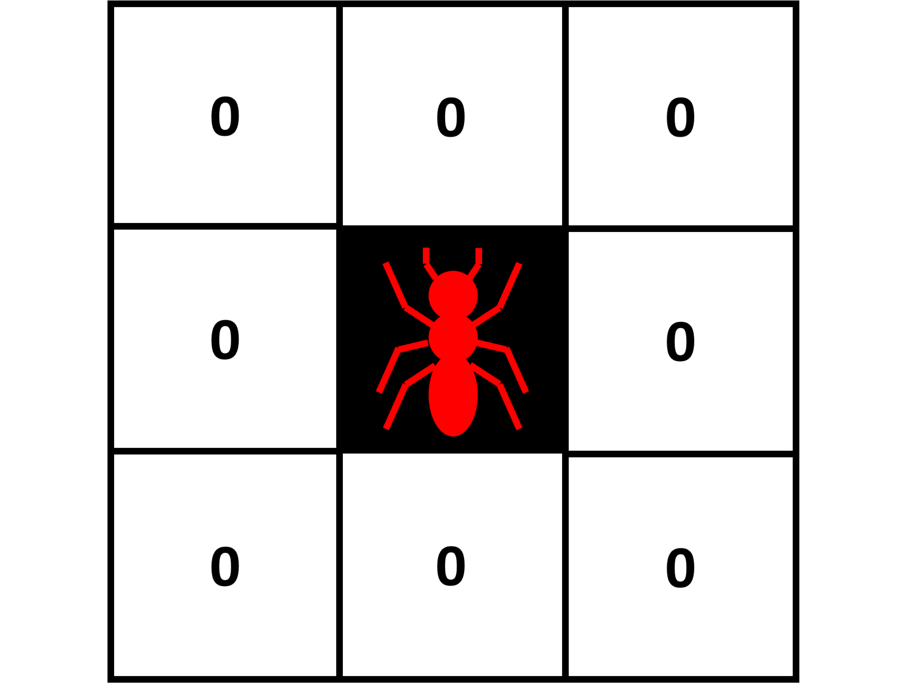
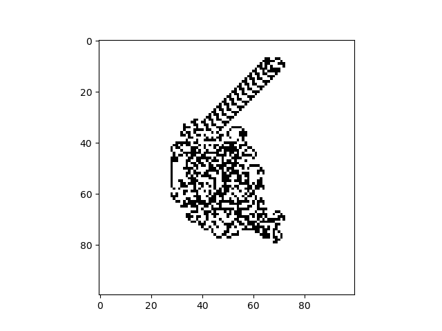
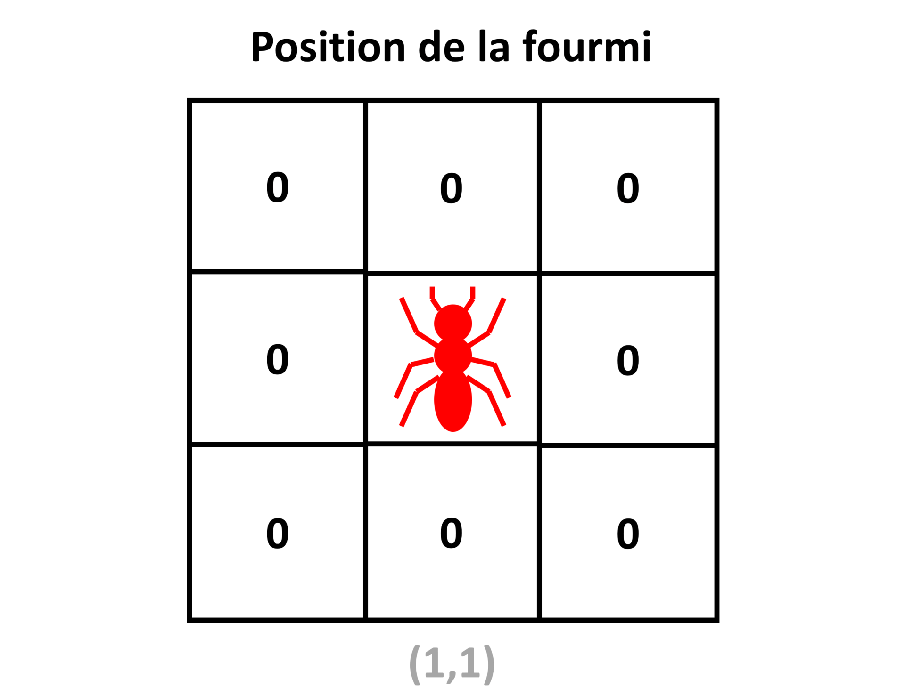

# TP 2 : Héritage et polymorphisme

_Lors de ce TP, nous allons programmer un automate cellulaire 2D de type "turmite", en complétant petit à petit une classe mère commune à tous les automates cellulaires 2D, puis une classe fille spécifique aux "turmites"._
_En fin de TP, nous réfléchirons à comment nous pourrions améliorer notre programme en s'appuyant sur les méthodes spéciales Python._

---

## Les Turmites

Ce TP portera sur un nouveau type d'automate cellulaire 2D : les **turmites**.

Leur principe est le suivant :
On imagine qu'une fourmi se déplace sur la grille de l'automate, où chaque case contient une valeur 0 ou 1.
A chaque itération, la fourmi ne peut se déplacer que d'une case.
Suivant les règles de l'automate, la fourmi peut changer ou non de direction, et changer ou non la valeur de la case sur laquelle elle se trouve.

Pour les automates vus aux TP précédents, chaque case pouvait potentiellement changer de valeur à chaque itération.
Dans le cas des "turmites", seule la case où se trouve la fourmi peut changer de valeur à une itération donnée.

La "**fourmi de Langton**" est probablement le "turmite" le plus connu.
Imaginé en 1986 par l'informaticien américain Christopher Langton, il est connu pour faire émerger un comportement ordonné et cyclique appelé "la route", après des milliers d'itérations d'un comportement chaotique.
Ce comportement fini toujours par apparaitre, qu'importe l'initialisation de la grille.

Depuis, d'autres turmites aux comportements intéressants ont été découverts.

Le nom "turmite" est la contraction de "Turing" et "termite".
En effet, les "turmites" sont théoriquement des "machines de Turing" (concept abstrait imaginé par le mathématicien anglais Alan Turing).
Et le mot "termite" fait référence à la fourmi de Langton se déplaçant sur la grille.

La fourmi d'un "turmite" est caractérisée par 4 propriétés :

* Sa **position** sur la grille (les coordonnées de la case sur laquelle elle se trouve).

* Son **orientation** (vers le haut, le bas, la droite, la gauche).

* La **valeur de la case** sur laquelle elle se trouve (0 ou 1).

* L'**état interne** de la fourmi (0 ou 1).

A chaque itération de l'automate, la fourmi va réaliser les opérations suivantes, dans cet ordre :

* La fourmi change ou non la valeur de la case sur laquelle elle se trouve, suivant des règles sur son état interne et de l'ancenne valeur de la case.

* La fourmi change d'orientation ou non, suivant des règles sur son état interne et l'ancienne valeur de la case sur laquelle elle se trouve.

* La fourmi change d'état interne ou non, suivant des règles sur son état interne et l'ancienne valeur de la case sur laquelle elle se trouve.

* La fourmi avance d'une case, dans la direction correspondant à son orientation.

On met souvent les règles d'un "turmite" sous la forme d'un tableau.
Voici celui de la fourmi de Langton.

|Etat de la fourmi|Valeur de la case|Nouvelle valeur de la case|Rotation de la fourmi|Nouvel état interne de la fourmi|
|:---------------:|:---------------:|:------------------------:|:-------------------:|:------------------------------:|
|0                |0                |1                         |R                    |0                               |
|0                |1                |0                         |L                    |0                               |
|1                |0                |1                         |R                    |1                               |       
|1                |1                |0                         |L                    |1                               |

(Pour la rotation, L = vers la gauche, R = vers la droite, U = demi-tour, N = pas de rotation).

Pour désigner rapidement la règle d'un turmite, on peut écrire les différentes lignes de ce tableau, séparées par des slashs.
Pour la fourmi de Langton, on parlera de règle '**1R0/0L0/1R1/0L1**'.

_Vérifions si vous avez bien compris. Quelles règles suivra l'automate '1L1/1L1/1R1/0N0' ? Pour vous aider, écrivez le tableau correspondant._

Lors de ce TP, nous allons programmer un automate cellulaire de type "turmite", sous la forme de 2 classes Python : une **classe mère** commune à tous les automates cellulaires 2D, et une **classe fille** propre aux automates "turmites", qui **héritera** de la classe mère.

**N'oubliez pas d'importer Numpy et Matplotlib au début de votre programme !**

## Définition de la classe mère

Nous allons commencer par définir la **classe mère** `2D_cellular_automaton`, qui contiendra les attributs et méthodes communs à tous les automates cellulaires 2D.
Pour définir un automate cellulaire en particulier, il suffira de définir une classe fille héritant de cette classe mère, sans avoir besoin de tout réécrire.

Voici la structure de la classe mère que nous allons programmer :

~~~
class 2D_cellular_automaton:
    
    def __init__(self,grid_size_x,grid_size_y):
        
		#Complétez ici
        
    def set_grid(self,grid):
        
		#Complétez ici
    
    def get_grid(self):
        
		#Complétez ici
        
    def set_rules(self):
        
		#Complétez ici
        
    def get_rules(self):
        
		#Complétez ici
        
    def get_iteration(self):
        
		#Complétez ici
        
    def iterate_grid(self):
		
		#Complétez ici
        
    def display_grid(self):
        plt.figure()
        plt.imshow(self.grid,cmap='binary')
        plt.show()
        
    def save_grid(self):
        plt.figure()
        plt.imshow(self.grid,cmap='binary')
        plt.savefig('automaton_'+str(self.iteration)+'.png')
        plt.close()
~~~

Cette structure doit vous dire quelque chose : elle ressemble beaucoup à celle de la classe programmée lors du TP précédent.

Vous devrez compléter petit à petit les méthodes de cette classe.

### Constructeur

Pour commencer, complétez le **constructeur** :

~~~
    def __init__(self,grid_size_x,grid_size_y):
        
		#Complétez ici
~~~

Il prendra en entrée 2 entiers `grid_size_x` et `grid_size_y` contenant les dimensions de la grille de l'automate.

Il initialisera 2 attributs d'instance de la manière suivante :

* `grid` en utilisant une méthode set_grid, qui prendra en entrée une matrice Numpy 2D ne contenant que des 0 de dimensions `grid_size_x` et `grid_size_y`, et que nous programmerons plus tard.

* `iteration` directement initialisé à 0, et qui nous servira à suivre le nombre d'itération pour lequel a tourné l'automate depuis son initialisation.

_Quelle ligne de commande utiliseriez-vous pour créer un automate cellulaire 2D quelconque de dimensions 100x100 ?_

### Getters

Nous allons à présent compléter les "**getters**".

Complétez la méthode `get_grid` suivante :

~~~
    def get_grid(self):
        
		#Complétez ici
~~~

Elle devra retourner une copie Numpy de l'attribut d'instance `grid`.
Cet attribut contiendra la grille de l'automate cellulaire.

Complétez la méthode `get_rules` suivante :

~~~
    def get_rules(self):
        
		#Complétez ici
~~~

Cette méthode n'ayant pas de sens tant que le type exact d'automate (et donc de règle) n'est pas connu, elle ne sera donc pas implémentée tout de suite.
Mais il s'agit d'une méthode nécessaire à tout automate cellulaire 2D, et devra donc être définie spécifiquement dans chaque classe fille.

Différentes classes filles pourront donc avoir différentes implémentations de `get_rules` : c'est le principe du **polymorphisme**.

La méthode `get_rules` renverra donc juste un message d'erreur de type `NotImplementedError`.

Complétez la méthode `get_iteration` suivante :

~~~
    def get_iteration(self):
        
		#Complétez ici
~~~

Elle devra retourner l'attribut d'instance `iteration`.
Cet attribut contiendra le nombre d'itérations effectuées par l'automate depuis son initialisation.

### Setters

Nous allons à présent compléter les "**setters**".

Complétez la méthode `set_grid` suivante :

~~~
    def set_grid(self,grid):
        
		#Complétez ici
~~~

Elle prendra en entrée une matrice 2D Numpy `grid`, et affectera une copie Numpy de cette matrice à l'attribut d'instance `grid`.

Ainsi, cette méthode permettra de mettre à jour l'attribut `grid` de l'automate avec une nouvelle grille.

~~~
    def set_rules(self):
        
		#Complétez ici
~~~

Tout comme pour `get_rules`, cette fonction est nécessaire à tout automate cellulaire 2D, mais doit être définie spécifiquement pour chaque type d'automate.

Elle renverra donc juste un message d'erreur de type `NotImplementedError`.

### Itération de l'automate

Les automates cellulaires étant des algorithmes itératifs, tout automate cellulaire 2D a besoin d'une méthode pour être itéré.
Cependant, le contenu exact de la méthode va dépendre du type d'automate que nous cherchons à implémenter.

Une fois de plus, nous allons donc définir un patron de méthode, qui devra être adapté dans les différentes classes filles.

Complétez la méthode `iterate_grid` suivante :

~~~
    def iterate_grid(self):
		
		#Complétez ici
~~~

Elle renverra juste un message d'erreur de type `NotImplementedError`.

### Affichage et export

Ajoutez les méthodes suivantes à votre classe mère :

~~~
    def display_grid(self):
	
        plt.figure()
        plt.imshow(self.grid,cmap='binary')
        plt.show()
        
    def save_grid(self):
	
        plt.figure()
        plt.imshow(self.grid,cmap='binary')
        plt.savefig('automaton_'+str(self.iteration)+'.png')
        plt.close()
~~~

La méthode `display_grid` servira à afficher l'état de la grille de l'automate à l'itération actuelle, sous la forme d'une image en noir et blanc (un pixel noir correspond à une case 1, un pixel blanc à une case 0).

La méthode `save_grid` servira à enregistrer une telle image de l'état de la grille de l'automate à l'itération actuelle, au format PNG.

Ces méthodes étant utiles pour tous les types d'automates cellulaires 2D, elles sont dans la classe mère.

## Définition de la classe fille

Maintenant que nous avons définit les attributs et méthodes communs à tous les automates cellulaires 2D, nous pouvons définir une **classe fille** `turmite`, qui va **hériter** de ces méthodes et attributs.

Voici la structure de la classe fille que nous allons programmer :

~~~
class turmite(2D_cellular_automaton):
    
    def __init__(self,grid_size_x,grid_size_y,rules_code,state,pos_x,pos_y,orientation):
        
		#Complétez ici
        
    def set_rules(self,rules_code):
        
		#Complétez ici
        
    def get_rules(self):
        
		#Complétez ici
        
    def set_state(self,state):
        
		#Complétez ici
        
    def get_state(self):
        
		#Complétez ici
    
    def set_position(self,pos_x,pos_y):
        
		#Complétez ici
        
    def get_position(self):
        
		#Complétez ici
    
    def set_value(self,value):
        
		#Complétez ici
        
    def get_value(self):
        
		#Complétez ici
    
    def set_orientation(self,orientation):
        
		#Complétez ici
        
    def get_orientation(self):
        
		#Complétez ici
    
    def __turn(self,direction):
        
		#Complétez ici
        
    def __move(self):
        
        #Complétez ici
    
    def iterate_grid(self,nb_iterations):
        
        #Complétez ici
~~~

_Comment avons-nous indiqué à Python que la classe `turmite` hérite de la classe `2D_cellular_automaton` ?_

_Vérifions si vous avez compris le concept d'héritage : comment feriez-vous pour récupérer le nombre d'itérations d'une instance `ant` de `turmite` ?_ 

Vous devriez remarquer que certaines des méthodes "non implémentées" que nous avions définies dans la classe mère seront **redéfinies** dans la classe fille.
Une autre classe fille pourra également redéfinir ces méthodes d'une autre manière : c'est le principe du **polymorphisme**.

Vous devriez également remarquer que 2 des méthodes sont **privées**.
Elles n'auront donc pas vocation à être appelées de l'extérieur.

_Avez-vous repéré quelles méthodes sont privées ? Comment savez-vous que ces méthodes sont privées ?_

Vous devrez compléter petit à petit les méthodes de cette classe.

### Constructeur

Pour commencer, complétez le **constructeur** :

~~~
    def __init__(self,grid_size_x,grid_size_y,rules_code,state,pos_x,pos_y,orientation):
        
		#Complétez ici
~~~

Elle prendra en entrée 2 entiers `grid_size_x` et `grid_size_y` contenant les dimensions de la grille de l'automate, une chaîne de caractères `rules_code` contenant les règles du "turmite", un entier `state` contenant l'état initial de la fourmi, 2 entiers `pos_x` et `pos_y` contenant la position initial de la fourmi sur la grille, et une chaîne de caractère `orientation` contenant l'orientation initiale de la fourmi ('up', 'down', 'right', 'left').

Elle appellera le constructeur de la classe mère avec les entrées `grid_size_x` et `grid_size_y`.

Ensuite, elle initialisera 4 attributs d'instance de la manière suivante :

* `rules` en utilisant une méthode `set_rules`, qui prendra en entrée `rules_code`, et que nous définirons plus tard.

* `state` en utilisant une méthode `set_state`, qui prendra en entrée `state`, et que nous définirons plus tard.

* `position` en utilisant une méthode `set_position`, qui prendra en entrée `pos_x` et `pos_y`, et que nous définirons plus tard.

* `orientation` en utilisant une méthode `set_orientation`, qui prendra en entrée `orientation`, et que nous définirons plus tard.

|Aide|
|:-|
|Pour appeler le constructeur de la classe mère dans la classe fille, on utilise `super().__init__()`, avec les entrées nécessaires pour créer une instance de la classe mère.|

_Quelle ligne de commande Python utiliseriez-vous pour créer une fourmi de Langton, avec une grille 100x100, les un état initial à 0, une position initiale à (0,0) et une orientation 'up'?_

### Getters

Nous allons à présent compléter les "**getters**".

Complétez la méthode `get_rules` suivante :

~~~
    def get_rules(self):
        
		#Complétez ici
~~~

Elle devra retourner l'attribut d'instance `rules`.
Cet attribut contiendra les règles de l'automate cellulaire.

Complétez la méthode `get_state` suivante :

~~~
    def get_state(self):
        
		#Complétez ici
~~~

Elle devra retourner l'attribut d'instance `state`.
Cet attribut contiendra l'état de la fourmi.

Complétez la méthode `get_position` suivante :

~~~
    def get_position(self):
        
		#Complétez ici
~~~

Elle devra retourner l'attribut d'instance `position`.
Cet attribut contiendra la position de la fourmi sur la grille de l'automate.

Complétez la méthode `get_value` suivante :

~~~
    def get_value(self):
        
		#Complétez ici
~~~

Elle devra retourner la valeur de la case de la grille sur laquelle se trouve la fourmi.

Complétez la méthode `get_orientation` suivante :

~~~
    def get_orientation(self):
        
		#Complétez ici
~~~

Elle devra retourner l'attribut d'instance `orientation`.
Cet attribut contiendra l'orientation de la fourmi.

### Setters

Nous allons à présent compléter les "**setters**".

Complétez la méthode `set_rules` suivante :

~~~
    def set_rules(self,rules_code):
        
		#Complétez ici
~~~

Elle prendra en entrée une chaîne de caractères `rules_code` contenant la définition des règles de l'automate au format décrit plus tôt.
Elle affectera à l'attribut d'instance `rules` une liste de liste, chaque liste contenant les 3 éléments entre slashs de la règle.

Par exemple, pour la fourmi de Langton, on obtiendra : `[[1,'R',0],[0,'L',0],[1,'R',1],[0,'L',1]]`.

Complétez la méthode `set_state` suivante :

~~~
    def set_state(self,state):
        
		#Complétez ici
~~~

Elle prendra en entrée un entier 0 ou 1 `state`, et affectera cette valeur à l'attribut d'instance `state`.

Ainsi, cette méthode permettra de mettre à jour l'état de la fourmi.

Complétez la méthode `set_position` suivante :

~~~
    def set_position(self,pos_x,pos_y):
        
		#Complétez ici
~~~

Elle prendra en entrée 2 entiers `pos_x` et `pos_y`, et affectera un tuple contenant `pos_x` et `pos_y` à l'attribut d'instance `position`.

Ainsi, la méthode permettra de mettre à jour la position de la fourmi sur la grille de l'automate.

Complétez la méthode `set_value` suivante :

~~~
    def set_value(self,value):
        
		#Complétez ici
~~~

Elle prendra en entrée un entier 0 ou 1 `value`, et affectera cette valeur à la case de la grille sur laquelle se trouve la fourmi.

Ainsi, la méthode permettra de mettre à jour la valeur de la case sur laquelle se trouve la fourmi.

Complétez la méthode `set_orientation` suivante :

~~~
    def set_orientation(self,orientation):
        
		#Complétez ici
~~~

Elle prendra en entrée une chaîne de caractères `orientation` contenant 'up', 'down', 'left' ou 'right', et affectera cette chaîne de caractères à l'attribut d'instance `orientation`.

Ainsi, la méthode permettra de mettre à jour l'orientation de la fourmi.

### Méthodes privées

Comme nous l'avions remarqué précédemment, notre classe fille `turmite` aura 2 **méthodes privées** `__turn` et `__move`.

Ces méthodes serviront respectivement à faire tourner et avancer la fourmi.

Elles n'auront pas vocation à être appelées de l'extérieur de la classe, mais par la méthode d'itération du "turmite".
D'où le fait qu'elles soient privées : nous ne voulons pas qu'un utilisateur fasse tourner ou bouger la fourmi par erreur en dehors des itérations de l'automate.

Complétez la méthode `__turn` suivante :

~~~
    def __turn(self,direction):
        
		#Complétez ici
~~~

Elle prendra en entrée une chaîne de caractères `direction`, contenant 'R', 'L', 'U' ou 'N', indiquant respectivement si la fourmi doit tourner à droite, à gauche, faire demi-tour ou garder son orientation actuelle.

Elle modifiera l'attribut d'instance `orientation` par une nouvelle chaîne de caractère 'up', 'down', 'left' ou 'right', correspondant à la nouvelle orientation de la fourmi après changement d'orientation.

Par exemple, une fourmi à l'orientation 'left' à laquelle on applique `__turn` avec l'entrée 'R' au la nouvelle orientation 'up'.

_Vérifions si vous avez bien compris le principe : si j'applique `__turn` à une foumi qui a l'orientation 'up', avec comme entrée 'U', quelle sera sa nouvelle orientation ?_

Complétez la méthode `__move` suivante :

~~~
    def __move(self):
        
        #Complétez ici
~~~

Elle modifiera l'attribut d'instance `position`, pour déplacer la fourmi d'une case dans la direction de son orientation : en haut si 'up', en bas si 'down', à gauche si 'left', à droite si 'right'.

### Itération de l'automate

Nous allons à présent programmer la méthode qui permettra d'itérer un "turmite" un nombre donné de fois.
L'idée sera d'appeler dans cette méthode d'autres méthodes programmées précédemment.

Complétez donc la méthode `iterate_grid` suivante :

~~~
    def iterate_grid(self,nb_iterations):
        
        #Complétez ici
~~~

Pour le nombre entier d'itérations `nb_iterations` donné en entrée, elle appliquera les règles du "turmite" (stockées dans l'attribut d'instance `rules`) à la fourmi et la case de la grille sur laquelle elle se trouve.
Pour chaque itération, on incrémentera de 1 l'attribut d'instance `iteration`.

_Voyons si vous avez tout compris :_
_Comment feriez-vous pour itérer 10 fois une instance de "turmite" `ant` ?_

## Instanciation et simulation

Ça y est, votre automate cellulaire "turmite" est prêt à tourner !

Faites tourner la "Fourmi de Langton" (règle '1R0/0L0/1R1/0L1') pour 11500 itérations, sur une grille 100x100 avec la fourmi initialisée au centre, la fourmi étant dans l'état initial 0, et orientée 'up'.
Enregistrez une image PNG de la grille de l'automate toutes les 100 itérations.

Si vous regardez les images PNG obtenues, vous devriez voir un comportement similaire à celui-ci :

Après des milliers d'itérations de déplacement chaotique, le fameux comportement émergent appelé "route" apparait clairement.

Mais il existe bien d'autres "turmites" au comportement intéressant.
Voici quelques exemples que vous pouvez essayer :

|Nom de l'automate|Règles         |
|:---------------:|:-------------:|
|Fourmi de Langton|1R0/0L0/1R1/0L1|
|Fibonacci        |1L1/1L1/1R1/0N0|
|Worm trails      |1R1/1L1/1R1/0R0|
|Snowflake        |0R1/1R1/1L1/1L0|
|Contoured island |0R1/0N1/1R1/1L0|
|Balloon bursting |1L0/1R1/0R1/1L0|

## Vers les méthodes spéciales

Lors de ce TP, nous avons définit un automate cellulaire "turmite" ne faisant se déplacer qu'une seule fourmi sur la grille.

Imaginons à présent que nous voulions programmer un automate cellulaire "turmite" contenant plusieurs foumis se déplaçant sur une même grille.
Comment pourrions adapter le programme que nous venons de réaliser ?

Pour commencer, nous pourrions définir une classe `ant`, contenant les attributs et méthodes propres à une fourmi.
Ensuite, une autre classe `colony`, servirait de conteneur à fourmis (instances de la classe `ant`), comme une "colonie de fourmis".
Enfin, la classe `turmite` serait initialisée avec une instance de `colony`.

Ouvrez un nouveau fichier Python, et essayer de compléter les classes suivantes et vous basant sur votre programme précédemment :

~~~
class 2D_cellular_automaton:

	#Complétez ici
	
class turmite(2D_cellular_automaton):

	#Complétez ici
	
class colony():

	#Complétez ici
	
class ant():

	#Complétez ici
~~~

La classe `colony` devra permettre d'ajouter / retirer des fourmis au conteneur avec les opérateur `+` et `-`, d'obtenir le nombre de fourmis contenus avec la méthode `len`, et d'itérer sur les fourmis d'une colonie.

Pour faire ceci, vous aurez besoin d'un concept nouveau : les **méthodes spéciales** Python.

_Comment définit-on une méthode spéciale en Python ?_

Vous pouvez tester votre nouvelle implémentation sur les mêmes exemples de "turmites" que précédemment.

---

Bravo ! Vous avez compris les notions d'**héritage** et de **polymorphisme**.
Lors des TP suivants, nous programmerons un nouveau type d'automates cellulaire, pour lequel nous aurons besoin de méthodes spéciales Python.