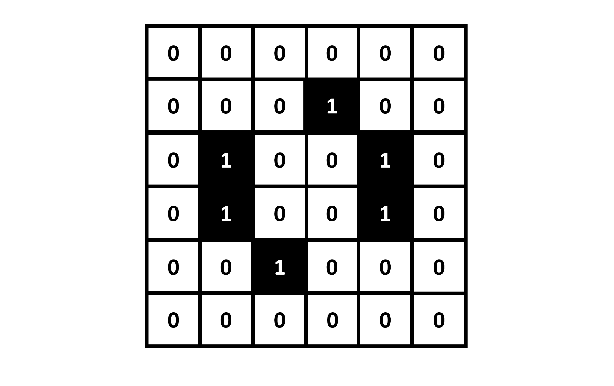
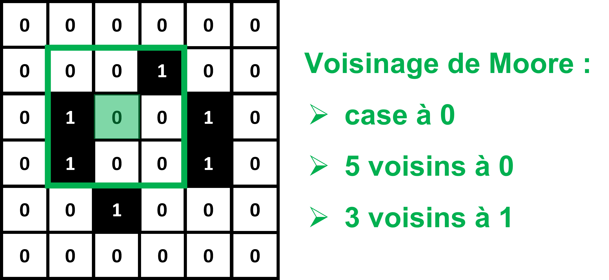
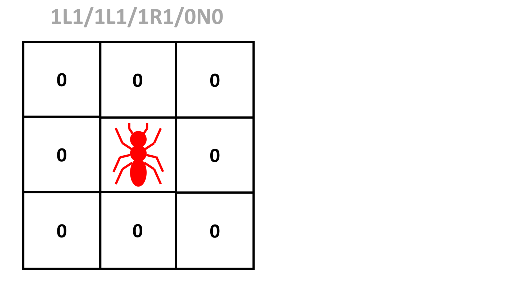

# TP 2 : Les classes, leurs attributs et leurs méthodes

_Lors de ce TP, nous allons programmer un automate cellulaire 2D de type "life-like", en complétant petit à petit les attributs et méthodes d'une classe._
_En fin de TP, nous réfléchirons à comment nous pourrions améliorer notre programme pour rendre certaines parties réutilisables par d'autres types d'automates cellulaires._

---

## Le Jeu de la Vie

Lors du TP précédent, nous avons vu des automates cellulaires 1D : chaque valeur d'une matrice 1D ne contenant que des 0 et des 1 évolue au fil des itérations, suivant des règles sur son voisinage.
Ce concept peut être étendu à une matrice 2D, et nous obtenons alors un **automate cellulaire 2D** :

Dans le cas d'un automate 1D, on définit le "voisinage" d'une case comme étant les cases directement à sa droite ou à sa gauche.
Pour un automate 2D, il nous faut une nouvelle définition de "voisinage".
La plus commune est le **voisinage de Moore** : les 8 cases entourant une case donnée.

Les règles d'un automate cellulaire 2D se basent en général sur 2 choses :

* La valeur de la case, 0 ou 1.

* Le nombre de ses 8 voisins égaux à 0 ou 1.

Les cas sur les bords pourront être gérés d'une manière similaire aux automates 1D.

En 1970, le mathématicien anglais John Horton Conway a découvert que pour des règles aussi simples émergent parfois des comportements complexes, donnant l'impression de voir des organismes vivant évoluer sur la grille de l'automate.

Un jeu de règles en particulier est devenu célèbre : le **"Jeu de la Vie"**.
Pour chaque itération :

* Si une case est à 0, et est entourée de 3 voisins à 1, alors elle passe à 1. Sinon, elle reste à 0.

* Si une case est à 1, et est entourée de 2 ou 3 voisins à 1, alors elle reste à 1. Sinon, elle passe à 0.

Ces règles font apparaitre des motifs se déplaçant plus ou moins vite sur la grille, intéragissant les uns avec les autres, ce qui leur donne l'apparence d'organismes vivant.

On fait d'ailleurs souvent l'analogie avec le vivant, en disant d'une case à 0 qu'elle est "morte", et d'une case à 1 qu'elle est "vivante".

Le "Jeu de la Vie" est probablement le plus connu de tous les automates cellulaires 2D.
Mais c'est loin d'être le seul à faire émerger des comportements complexes.

On qualifiera de **"life-like"** tout automate cellulaire 2D donnant l'impression de voir des organismes vivant naître, évoluer et mourir.

Afin de définir les règles d'un automate cellulaire "life-like" de manière standardisée, on utilise souvent la notation **B/S**.

B et S sont des séries de numéros entre 0 et 8 correspondant respectivement aux nombres de voisins "vivants" (à 1) pour qu'une case "naisse" (passe de 0 à 1), et au nombre de voisins "vivants" (à 1) pour qu'une case puisse survivre (rester à 1).

On en déduit que le "Jeu de la Vie" peut être définit au format B/S par : **3/23**.

_Vérifions si vous avez bien compris. L'automate cellulaire "diamoeba" est définit par 35678/5678. Quelles sont donc ses règles ?_

Lors de ce TP, nous allons programmer un automate cellulaire de type "life-like", sous la forme d'une **classe** Python avec des attributs et des méthodes qu'il nous faudra définir.

**N'oubliez pas d'importer Numpy et Matplotlib au début de votre programme !**

## Définition de classe et constructeur

Pour définir un automate cellulaire "life-like" dans Python, nous allons créer une classe "life-like", qui définira les attributs et méthodes nécessaires à tous les automates cellulaires.
Il suffira ensuite de créer une instance de cette classe pour pouvoir simuler un automate cellulaire "life-like" en particulier.

Voici la structure de la classe que nous allons programmer :

~~~
class life_like:
    
    def __init__(self,rules_code,grid_size_x,grid_size_y):
        
		#Complétez ici
        
    def set_rules(self,rules_code):
        
		#Complétez ici
        
    def get_rules(self):
        
		#Complétez ici
        
    def set_random_grid(self,grid_size_x,grid_size_y):
        
		#Complétez ici
        
    def set_grid(self,grid):
        
		#Complétez ici
    
    def get_grid(self):
        
		#Complétez ici
    
    def get_grid_size(self):
        
		#Complétez ici
                
    def get_neighbors(self):
        
		#Complétez ici
        
    def get_iteration(self):
        
		#Complétez ici
        
    def iterate_grid(self,nb_iterations):
	
        #Complétez ici
        
    def display_grid(self):
        plt.figure()
        plt.imshow(self.grid,cmap='binary')
        plt.show()
        
    def save_grid(self):
        plt.figure()
        plt.imshow(self.grid,cmap='binary')
        plt.savefig('automaton_'+str(self.iteration)+'.png')
        plt.close()
~~~

Vous devrez compléter petit à petit les méthodes de cette classe.

Pour commencer, complétez le constructeur :

~~~
    def __init__(self,rules_code,grid_size_x,grid_size_y):
        
		#Complétez ici
~~~

Il prendra en entrée une chaîne de caractères `rules_code` contenant la définition de l'automate au format 'B/S', et 2 entiers `grid_size_x` et `grid_size_y` contenant les dimensions de la grille de l'automate.

Il initialisera 3 attributs d'instance de la manière suivante :

* `rules` en utilisant une méthode `set_rules`, qui prendra en entrée `rules_code`, et que nous programmerons plus tard.

* `grid` en utilisant une méthode `set_random_grid`, qui prendra en entrée `grid_size_x` et `grid_size_y`, et que nous programmerons plus tard.

* `iteration` directement initialisé à 0, et qui nous servira à suivre le nombre d'itération pour lequel a tourné l'automate.

## Définir les getters

~~~
	def get_rules(self):
        
		#Complétez ici
~~~

~~~
	def get_grid(self):
        
		#Complétez ici
~~~

~~~
    def get_grid_size(self):
        
		#Complétez ici
~~~

~~~
    def get_neighbors(self):
        
		#Complétez ici
~~~

~~~ 
    def get_iteration(self):
        
		#Complétez ici
~~~

## Définir les setters

~~~
    def set_rules(self,rules_code):
        
		#Complétez ici
~~~

~~~
    def set_random_grid(self,grid_size_x,grid_size_y):
        
		#Complétez ici
~~~

~~~
    def set_grid(self,grid):
        
		#Complétez ici
~~~

## Méthode pour itérer l'automate

~~~
    def iterate_grid(self,nb_iterations):
	
        #Complétez ici
~~~

## Instanciation et simulation

## Vers la notion d'héritage