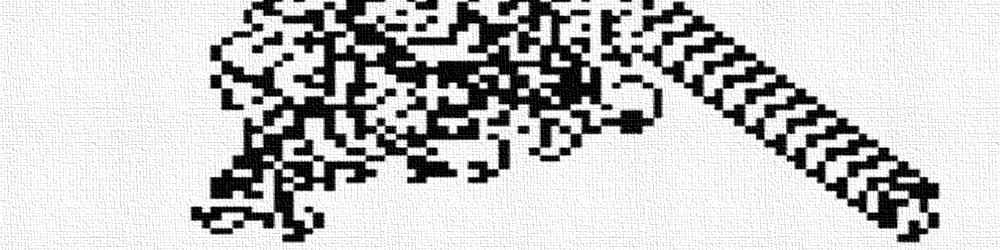

# TP 2 : Héritage et polymorphisme

_Lors de ce TP, nous allons programmer un automate cellulaire 2D de type "turmite", en complétant petit à petit une classe mère commune à tous les automates cellulaires 2D, puis une classe fille spécifique aux "turmites"._
_En fin de TP, nous réfléchirons à comment nous pourrions améliorer notre programme en s'appuyant sur les méthodes spéciales Python._

---

## Les Turmites

Ce TP portera sur un nouveau type d'automate cellulaire 2D : les **turmites**.

Leur principe est le suivant :
On imagine qu'une fourmi se déplace sur la grille de l'automate, où chaque case contient une valeur 0 ou 1.
A chaque itération, la fourmi ne peut se déplacer que d'une case.
Suivant les règles de l'automate, la fourmi peut changer ou non de direction, et changer ou non la valeur de la case sur laquelle elle se trouve.

Pour les automates vus aux TP précédents, chaque case pouvait potentiellement changer de valeur à chaque itération.
Dans le cas des "turmites", seule la case où se trouve la fourmi peut change de valeur à une itération donnée.

La "**fourmi de Langton**" est probablement le "turmite" le plus connu.
Imaginé en 1986 par l'informaticien américain Christopher Langton, il est connu pour faire émerger un comportement ordonné et cyclique appelé "la route", après des milliers d'itérations d'un comportement chaotique.
Ce comportement fini toujours par apparaitre, qu'importe l'initialisation de la grille.

Depuis, d'autres turmites aux comportements intéressants ont été découverts.

Le nom "turmite" est la contraction de "Turing" et "termite".
En effet, les "turmites" sont théoriquement des "machines de Turing" (concept abstrait imaginé par le mathématicien anglais Alan Turing).
Et le mot "termite" fait référence à la fourmi de Langton se déplaçant sur la grille.

La fourmi d'un "turmite" est caractérisée par 4 propriétés :

* Sa **position** sur la grille (les coordonnées de la case sur laquelle elle se trouve).

* Son **orientation** (vers le haut, le bas, la droite, la gauche).

* La **valeur de la case** sur laquelle elle se trouve (0 ou 1).

* L'**état interne** de la fourmi (0 ou 1).

A chaque itération de l'automate, la fourmi va réaliser les opérations suivantes, dans cet ordre :

* La fourmi change ou non la valeur de la case sur laquelle elle se trouve, suivant des règles sur son état interne et de l'ancenne valeur de la case.

* La fourmi change d'orientation ou non, suivant des règles sur son état interne et l'ancienne valeur de la case sur laquelle elle se trouve.

* La fourmi change d'état interne ou non, suivant des règles sur son état interne et l'ancienne valeur de la case sur laquelle elle se trouve.

* La fourmi avance d'une case, dans la direction correspondant à son orientation.

On met souvent les règles d'un "turmite" sous la forme d'un tableau.
Voici celui de la fourmi de Langton.

|Etat de la fourmi|Valeur de la case|Nouvelle valeur de la case|Rotation de la fourmi|Nouvel état interne de la fourmi|
|:---------------:|:---------------:|:------------------------:|:-------------------:|:------------------------------:|
|0                |0                |1                         |R                    |0                               |
|0                |1                |0                         |L                    |0                               |
|1                |0                |1                         |R                    |1                               |       
|1                |1                |0                         |L                    |1                               |

(Pour la rotation, L = vers la gauche, R = vers la droite, U = demi-tour, N = pas de rotation).

Pour désigner rapidement la règle d'un turmite, on peut écrire les différentes lignes de ce tableau, séparées par des slashs.
Pour la fourmi de Langton, on parlera de règle '**1R0/0L0/1R1/0L1**'.

_Vérifions si vous avez bien compris. Quelles règles suivra l'automate '1L1/1L1/1R1/0N0' ? Pour vous aider, écrivez le tableau correspondant._

**N'oubliez pas d'importer Numpy et Matplotlib au début de votre programme !**

## Définition de la classe mère

~~~
class 2D_cellular_automaton:
    
    def __init__(self,grid_size_x,grid_size_y):
        
		#Complétez ici
        
    def set_grid(self,grid):
        
		#Complétez ici
    
    def get_grid(self):
        
		#Complétez ici
        
    def set_rules(self,rules_code):
        
		#Complétez ici
        
    def get_rules(self):
        
		#Complétez ici
        
    def get_iteration(self):
        
		#Complétez ici
        
    def iterate_grid(self):
		
		#Complétez ici
        
    def display_grid(self):
        plt.figure()
        plt.imshow(self.grid,cmap='binary')
        plt.show()
        
    def save_grid(self):
        plt.figure()
        plt.imshow(self.grid,cmap='binary')
        plt.savefig('automaton_'+str(self.iteration)+'.png')
        plt.close()
~~~

### Constructeur

### Getters

### Setters

## Définition de la classe fille

~~~
class turmite(2D_cellular_automaton):
    
    def __init__(self,grid_size_x,grid_size_y,rules_code,state,pos_x,pos_y,orientation):
        
		#Complétez ici
        
    def set_rules(self,rules_code):
        
		#Complétez ici
        
    def get_rules(self):
        
		#Complétez ici
        
    def set_state(self,state):
        
		#Complétez ici
        
    def get_state(self):
        
		#Complétez ici
    
    def set_position(self,pos_x,pos_y):
        
		#Complétez ici
        
    def get_position(self):
        
		#Complétez ici
    
    def set_value(self,value):
        
		#Complétez ici
        
    def get_value(self):
        
		#Complétez ici
    
    def set_orientation(self,orientation):
        
		#Complétez ici
        
    def get_orientation(self):
        
		#Complétez ici
    
    def turn(self,direction):
        
		#Complétez ici
        
    def move(self):
        
        #Complétez ici
    
    def iterate_grid(self,nb_iterations):
        
        #Complétez ici
~~~

### Constructeur

### Getters

### Setters

## Instanciation et simulation

## Vers les méthodes spéciales

---

