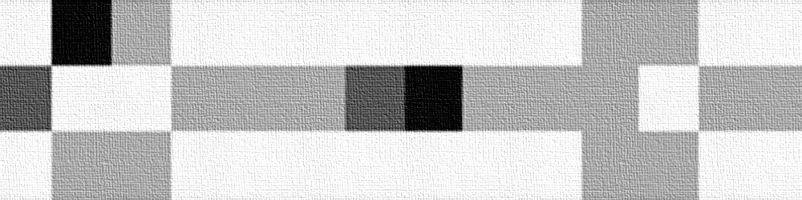
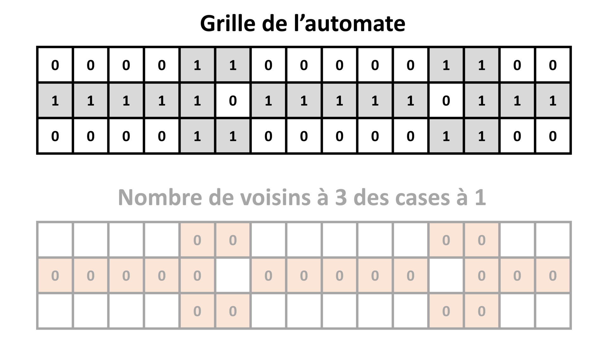
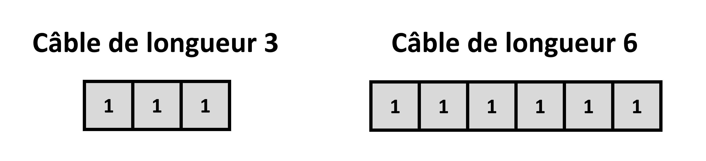
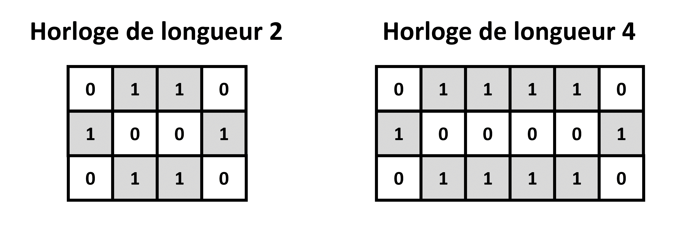
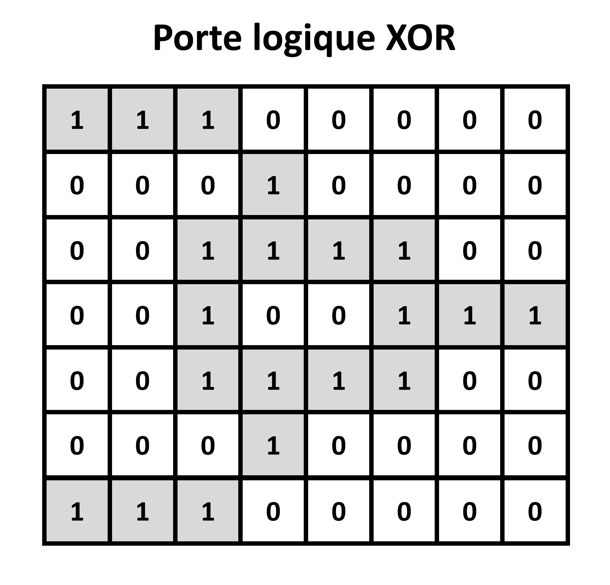
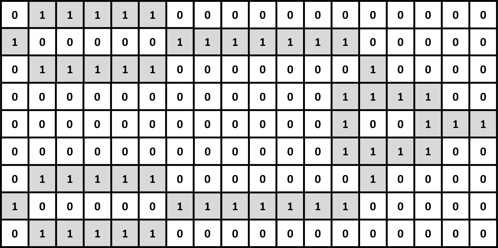
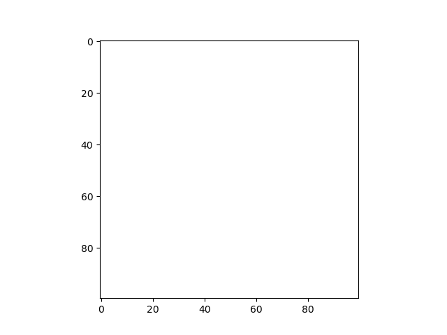

# TP 3 : Les méthodes spéciales

_Lors de ce TP, nous allons programmer un automate cellulaire 2D de type "Wire-world", en complétant différentes classes, ayant différentes intéractions : électrons, charges, composants, circuit, automate, etc._
_Ces différentes classes feront appel à un concept très utile : les méthodes spéciales Python._

---

## Wire-world

Ce TP portera à nouveau sur un type particulier d'automate cellulaire 2D : **Wire-world**.

Imaginé en 1987 par l'informaticien Canadien Brian Silverman, "Wire-world" est à l'origine conçu comme un jeu éducatif.
Comme son nom l'indique, le but est de simuler un circuit électronique, avec des câbles, des composants, et des électrons se déplaçant sur le circuit.

Contrairement aux automates que nous avons programmés précédemment, dont la grille ne pouvait contenir que les valeurs 0 ou 1, la grille de "Wire-world" peut contenir les valeurs 0, 1, 2 ou 3.
Si une case est à la valeur :

* 0 on la considère comme "vide" ou "isolante".

* 1 on la considère comme un "conducteur".

* 2 on la considère comme la "queue d'un électron".

* 3 on la considère comme la "tête d'un électron".

On initialise un circuit en positionnant des 0 et des 1 sur la grille.
Ensuite, on ajoute un ou plusieurs électrons quelque part sur du conducteur, avec un 2 et un 3 collés l'un à l'autre.

Les cases de la grille changent ou non de valeur à chaque itération, suivant les règles suivantes :

* Si une case est à 0, elle restera toujours à 0.

* Si une case est à 3, elle passe à 2 à l'itération suivante.

* Si une case est à 2, elle passe à 1 à l'itération suivante.

* Si une case est à 1, si 1 ou 2 de ses voisins (voisinage de Moore) est à la valeur 3, alors elle passe à 3 à l'itération suivante.
Sinon, elle reste à 1.

Avec ce jeu de règles simples, on peut simuler différent types de composants de la vie réelle : des câbles électriques, des diodes, des horloges, des portes logiques, et même des transistors.

Lors de ce TP, nous allons programmer un automate cellulaire "Wire-world", sous la forme de plusieurs classes Python :

* Des classes pour un électron et un conteneur d'életrons (que l'on appelera "charges").

* Des classes pour les composants, et un conteneur de composants (que l'on appelera "circuit").

* Une classe pour un automate cellulaire 2D de manière générale, et une classe pour un automate "Wire-world" en particulier.

Ces classes feront appel à des **méthodes spéciales** Python.

**N'oubliez pas d'importer Numpy et Matplotlib au début de votre programme !**

## Définition des électrons

### Un électron

~~~
class electron():
    
    #Complétez ici
~~~

### Un conteneur d'électrons (charges)

~~~
class charges():
    
    def __init__(self):
        #Complétez ici
        
    def __len__(self):
        #Complétez ici
        
    def __getitem__(self,i):
        #Complétez ici
        
    def __setitem__(self,i,elec):
        #Complétez ici
        
    def __iter__(self):
        self.index = -1
        return self
        
    def __next__(self):
        self.index += 1
        if self.index < len(self):
            return self[self.index]
        else:
            raise StopIteration
        
    def __add__(self,elec):
        #Complétez ici 
        
    def __sub__(self,elec):
        #Complétez ici  
~~~

## Définition des composants

### Un composant

~~~
class component():
        
    #Complétez ici
~~~

### Les différents types de composants

#### Le câble

~~~
class wire(component):
        
    #Complétez ici
~~~

#### L'horloge

~~~
class clock(component):
    
    #Complétez ici
~~~

#### La porte logique XOR

~~~
class xor(component):
    
    #Complétez ici
~~~

### Un conteneur de composants (circuit)

~~~
class circuit():
    
    def __init__(self):
        #Complétez ici
        
    def __len__(self):
        #Complétez ici
        
    def __getitem__(self,i):
        #Complétez ici
        
    def __setitem__(self,i,compo):
        #Complétez ici
        
    def __iter__(self):
        self.index = -1
        return self
        
    def __next__(self):
        self.index += 1
        if self.index < len(self):
            return self[self.index]
        else:
            raise StopIteration
        
    def __add__(self,compo):
        #Complétez ici
        
    def __sub__(self,compo):
        #Complétez ici  
~~~

## Définition de l'automate cellulaire

### Un automate cellulaire 2D

~~~
class 2D_cellular_automaton():
    
    def __init__(self,grid_size_x,grid_size_y):
        self.iteration = 0
        self.set_grid(np.zeros((grid_size_x,grid_size_y)))
        
    def set_grid(self,grid):
        self.grid = np.copy(grid)
    
    def get_grid(self):
        return np.copy(self.grid)
    
    def get_grid_size(self):
        size_x,size_y = np.shape(self.grid)
        return size_x,size_y
        
    def get_iteration(self):
        return self.iteration
        
    def iterate_grid(self):
        raise NotImplementedError('Méthode non implémentée pour un automate en général.')
        
    def display_grid(self):
        plt.figure()
        plt.imshow(self.grid,cmap='binary')
        plt.show()
        
    def save_grid(self):
        plt.figure()
        plt.imshow(self.grid,cmap='binary')
        plt.savefig('automaton_'+str(self.iteration)+'.png')
        plt.close()
~~~

### Un automate cellulaire Wire-world

## Instanciation et simulation

---