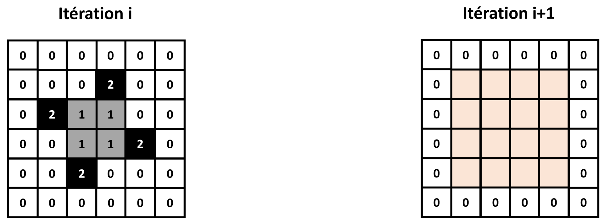

# TP examen : sujet de 2025

_Lors de cet examen, nous allons programmer un automate cellulaire 2D de type "Brian's brain" en paradigme orienté objet._

---

## Brian's brain

Cet examen portera à nouveau sur un type particulier d'automate cellulaire 2D : **Brian's brain**.

Imaginé en 1987 par l'informaticien Canadien Brian Silverman, cet automate cellulaire est connu pour son comportement émergent complexe et foisonnant.
De nombreuses structures appelées "vaisseaux" se déplacent rapidement sur la grille et s'entrechoquent, pour former d'autres "vaisseaux".

Chaque case de la grille d'un automate "Brian's brain" peut prendre **3 états** :

* Si la case est à 0, elle est considérée comme "**morte**".

* Si la case est à 1, elle est considérée comme "**mourrante**".

* Si la case est à 2, elle est considérée comme "**vivante**".

**Toutes les cases** de l'automate peuvent changer de valeur à chaque itération, en suivant le jeu de règles suivantes, basées sur la valeur de la case et son **voisinage de Moore** :

* Si une case a la valeur 2, elle prendra la valeur 1 à l'itération suivante.

* Si une case a la valeur 1, elle prendra la valeur 0 à l'itération suivante.

* Si une case a la valeur 0, et qu'elle a 2 voisins à la valeur 2, elle prendra la valeur 2 à l'itération suivante.
Sinon, elle restera à la valeur 0.

Brian's brain étant un automate cellulaire "life-like" mais avec une état supplémentaire "mourrant" pour chaque case, on le classe dans la sous-catégorie des automates "**generations**".

Lors de cet examen, nous allons programmer un automate cellulaire "Brian's brain", sous la forme d'une **classe mère** commune à tous les automates cellulaire 2D, et d'une **classe fille** spécifique aux automates "Brian's brain".
Nous ferons appel aux notions de programmation **orientée objet** vues en TP.

**N'oubliez pas d'importer Numpy et Matplotlib au début de votre programme !**

## Définition de la classe mère

Nous allons commencer par définir la **classe mère** `cellular_automaton_2D`, qui contiendra les attributs et méthodes communs à tous les automates cellulaires 2D. 

_Quel est l'intérêt de diviser notre programme en une classe mère et une classe fille ?_

Voici la structure de la classe mère que nous allons programmer :

~~~
class cellular_automaton_2D():
    
    def __init__(self,grid_size_x,grid_size_y):
	
        #Complétez ici
        
    def set_grid(self,grid):
	
        #Complétez ici
    
    def get_grid(self):
	
        #Complétez ici
    
    def get_grid_size(self):
	
        #Complétez ici
        
    def get_iteration(self):
	
        #Complétez ici
        
    def iterate_grid(self):
	
        #Complétez ici
        
    def display_grid(self):
	
        plt.figure()
        plt.imshow(self.grid,cmap='binary')
        plt.show()
        
    def save_grid(self):
	
        plt.figure()
        plt.imshow(self.grid,cmap='binary')
        plt.savefig('automaton_'+str(self.iteration)+'.png')
        plt.close()
~~~

Vous devrez compléter petit à petit les méthodes de cette classe.

### Constructeur

_Rappelez le rôle du constructeur ?_

Complétez le **constructeur** :

~~~
    def __init__(self,grid_size_x,grid_size_y):
        
		#Complétez ici
~~~

Il prendra en entrée 2 entiers `grid_size_x` et `grid_size_y` contenant les dimensions de la grille de l'automate.

Il initialisera 2 attributs d'instance de la manière suivante :

* `grid` en utilisant une méthode set_grid, qui prendra en entrée une matrice Numpy 2D ne contenant que des 0 de dimensions `grid_size_x` et `grid_size_y`, et que nous programmerons plus tard.

* `iteration` directement initialisé à 0, et qui nous servira à suivre le nombre d'itération pour lequel a tourné l'automate depuis son initialisation.

_Comment et quand fait-on appel au constructeur ?_

### Getters

_Quel est le rôle d'une méthode "getter" ?_

Complétez la méthode `get_grid` suivante :

~~~
    def get_grid(self):
        
		#Complétez ici
~~~

Elle devra retourner une copie Numpy de l'attribut d'instance `grid`.
Cet attribut contiendra la grille de l'automate cellulaire.

Complétez la méhode `get_grid_size` suivante :

~~~
    def get_grid_size(self):
	
        #Complétez ici
~~~

Elle devra retourner les dimensions de la matrice Numpy contenue dans l'attribut d'instance `grid`.
Elle renverra donc les dimensions de la grille de l'automate.

Complétez la méthode `get_iteration` suivante :

~~~
    def get_iteration(self):
        
		#Complétez ici
~~~

Elle devra retourner l'attribut d'instance `iteration`.
Cet attribut contiendra le nombre d'itérations effectuées par l'automate depuis son initialisation.

_Comment récupérer le nombre d'itérations d'une instance `automaton` de `cellular_automaton_2D` ?_

### Setter

_Quel est le rôle d'une méthode "setter" ?_

Complétez la méthode `set_grid` suivante :

~~~
    def set_grid(self,grid):
	
        #Complétez ici
~~~

Elle prendra en entrée une matrice 2D Numpy `grid`, et affectera une copie Numpy de cette matrice à l'attribut d'instance `grid`.

_Comment affecter une matrice Numpy 100x100 ne contenant que des 0 à l'attribut d'instance `grid` d'une instance `automaton` de `cellular_automaton_2D` ?_

### Itération de l'automate

Les automates cellulaires étant des algorithmes itératifs, tout automate cellulaire 2D a besoin d'une méthode pour être itéré.

Complétez la méthode `iterate_grid` suivante :

~~~
    def iterate_grid(self):
		
		#Complétez ici
~~~

Elle renverra juste un message d'erreur de type `NotImplementedError`.

_Bizarre, nous avons définit une fonction que ne fait que renvoyer un message d'erreur. Quel est l'intérêt de faire ceci ?_

### Méthodes d'export

Les 2 méthodes d'exports `display_grid` et `save_grid` vous sont déjà fournies.
Vous pouvez les utiliser telles quelles :

~~~
    def display_grid(self):
	
        plt.figure()
        plt.imshow(self.grid,cmap='binary')
        plt.show()
        
    def save_grid(self):
	
        plt.figure()
        plt.imshow(self.grid,cmap='binary')
        plt.savefig('automaton_'+str(self.iteration)+'.png')
        plt.close()
~~~

_Expliquez ce que permettent de faire ces 2 méthodes._

## Définition de la classe fille

Nous allons maintenant définir la **classe fille** `brian_brain`, qui contiendra les attributs et méthodes spécifiques aux automates "Brian's brain". 

_Comment Python sait-il qu'il s'agit d'une classe fille de `cellular_automaton_2D` ?_

Voici la structure de la classe fille que nous allons programmer :

~~~
class brian_brain(cellular_automaton_2D):
    
    def __init__(self,grid_size_x,grid_size_y):
        
		#Complétez ici
                
    def set_random_grid(self,grid_size_x,grid_size_y):
        
		#Complétez ici
    
    def get_neighbors(self):
        
		#Complétez ici
    
    def iterate_grid(self,nb_iterations):
        
        #Complétez ici
~~~

Vous devrez compléter petit à petit les méthodes de cette classe.

### Constructeur

Complétez le **constructeur** :

~~~
    def __init__(self,grid_size_x,grid_size_y):
        
		#Complétez ici
~~~

Elle prendra en entrée 2 entiers `grid_size_x` et `grid_size_y` contenant les dimensions de la grille de l'automate.

Elle appellera le constructeur de la classe mère avec les entrées `grid_size_x` et `grid_size_y`, puis appellera la méthode `set_random_grid` avec ces mêmes entrées.
Nous programmerons cette méthode dans la suite.

### Getter

Complétez la méthode `get_neighbors` suivante :

~~~
    def get_neighbors(self):
        
		#Complétez ici
~~~

Elle devra retourner une matrice d'entiers Numpy de même dimensions que `grid`, contenant pour chaque case le nombre de voisins (voisinage de Moore) "vivants" (à la valeur 2) dans la case de même position dans `grid`.

Cette méthode nous permettra de déterminer à une itération donnée le nombre de voisins "vivants" de chaque case de la grille, afin de pouvoir lui appliquer les règles de l'automate.

_Comment avez-vous choisi de gérer les cas sur les bords ?_

### Setter

Complétez la méthode `set_random_grid` suivante :

~~~
    def set_random_grid(self,grid_size_x,grid_size_y):
        
		#Complétez ici
~~~

Elle prendra en entrée 2 entiers `grid_size_x` et `grid_size_y`, qui correspondront aux dimensions de la grille voulue pour l'automate.

Elle affectera à l'attribut d'instance `grid` une matrice Numpy 2D aux dimensions voulues.
Cette matrice aura des 0 partout, sauf dans un carré en son centre qui aura des valeurs aléatoires entre 0 et 2.
Ce carré sera 10 fois plus petit que la matrice.

Cette méthode nous permettra d'initialiser aléatoirement la partie centrale de l'automate.

|Nota Bene|
|:-|
|Nous initialiserons de cette manière la matrice 2D de l'automate "Brian's brain" pour permettre de visualiser des motifs :|
|- Trop peu de cases initialisées à 1 ou 2, et l'automate devient rapidement rempli de 0.|
|- Trop de cases initialisées à 1 ou 2, et il devient très difficile de visualer des motifs sur la grille de l'automate.|
|Il s'agit donc ici d'un compromis.|

### Itération de l'automate

Nous allons à présent programmer la méthode qui permettra de d'itérer un automate "Brian's brain" un nombre donné de fois.
L'idée sera d'appeler dans cette méthode d'autres méthodes programmées précédemment.

Complétez donc la méthode `iterate_grid` suivante :

~~~
    def iterate_grid(self,nb_iterations):
        
        #Complétez ici
~~~

Pour le nombre entier d'itérations `nb_iterations` donné en entrée, elle appliquera les règles de "Brian's brain" à la grille de l'automate.
Pour chaque itération, on incrémentera de 1 l'attribut d'instance `iteration`.

## Instanciation et simulation

Ça y est, votre automate cellulaire "Brian's brain" est prêt à tourner !

Faites tourner "Brian's brain" pour 300 itérations, avec une grille de dimensions 200x200.
Vous enregistrerez une image PNG de la grille de l'automate à chaque itération.

Si vous regardez les images PNG obtenues, vous devriez voir un comportement similaire à celui-ci :

_Imaginons que vous vouliez à présent faire tourner un nouvel automate cellulaire "Brian's brain" avec des dimensions 100x100, pour 50 itérations. Comment feriez-vous ?_

_Et si vous désiriez programmer un nouvel automate cellulaire 2D, avec des règles différentes de "Brian's brain", comment feriez-vous ?_